<div align="center">



<br/>

**Computer Science engineer who turns ideas into working systems —<br/>applied AI where it earns its place, and the backend, data and interfaces that make it usable.**

<br/>

<a href="https://harshitha-portfolio-inky.vercel.app/"></a>&nbsp;<a href="https://www.linkedin.com/in/s-harshitha-1aa69a258/"></a>&nbsp;<a href="mailto:harshithasugreevu@gmail.com"></a>

<sub>
<a href="#-how-i-build">How I build</a> ·
<a href="#-what-i-build">What I build</a> ·
<a href="#-selected-work">Selected work</a> ·
<a href="#-the-journey-so-far">Journey</a> ·
<a href="#-toolkit">Toolkit</a> ·
<a href="#-lets-connect">Connect</a>
</sub>

</div>

<br/>


## ✦ How I build

I like owning a problem end to end — from the first question (*what actually has to be true for this to work?*) through the data model, the API, the interface, the tests and the deployment. Most of my recent systems put a language model somewhere in the loop, and the pattern I keep coming back to is simple: **the model reads, code decides.** The LLM extracts, classifies or drafts; validated schemas, deterministic rules, database constraints and role checks make every decision that matters. That keeps the system explainable, testable and honest when a provider is down or wrong.

## ✦ About me

I'm an early-career software engineer — B.Tech in Computer Science Engineering, **SRM University AP** (2022–2026). My work sits where machine learning meets software engineering: I've trained CNNs and hybrid ML models, and I've built the platforms around models — authentication, RBAC, workflows, SLA engines, background processing, audit trails and cloud deployments.

Outside the code, I'm the kind of engineer who reads the failure cases first: what happens on a duplicate request, an expired deadline, a malformed model response, a concurrent booking. Those questions shape most of what's in these repositories.


## ✦ What I build

<table>
<tr>
<td width="50%" valign="top">

### 🧠 Applied AI systems
LLM classification, extraction and function calling over OpenAI, Gemini and Groq — always behind schema validation and deterministic rules.
<br/><sub>CommitmentOS · Resolve · ClinicalNote · JARVIS AI</sub>

</td>
<td width="50%" valign="top">

### ⚙️ Backend & APIs
FastAPI, Express and Spring Boot services with JWT auth, server-side RBAC, relational data models, migrations and rate limiting.
<br/><sub>Resolve · SRMAP EventSphere · ClinicalNote · GST Billing</sub>

</td>
</tr>
<tr>
<td width="50%" valign="top">

### 🌐 Full-stack products
End-to-end applications — React / Next.js front ends on real APIs and databases, deployed on Vercel, Render and Cloud Run.
<br/><sub>EventSphere · MIC Leave Management · Complaint Platform</sub>

</td>
<td width="50%" valign="top">

### 🔁 Intelligent automation
Workflow orchestration with n8n, schedulers, job queues with retries and dead-letter handling, SLA timers and escalations.
<br/><sub>CommitmentOS · queuectl · Resolve · Complaint Platform</sub>

</td>
</tr>
<tr>
<td width="50%" valign="top">

### 👁️ Machine learning & vision
U-Net lane segmentation, hybrid clustering + MLP recommendation, classical classifiers, value iteration and MediaPipe hand tracking.
<br/><sub>Lane Detection & ADAS · Weight-Loss (IEEE) · Heart Disease</sub>

</td>
<td width="50%" valign="top">

### 📊 Data & enterprise
Python ETL into a PostgreSQL star schema, window-function SQL and RFM segmentation; SAP Fiori apps on SAP CAP and OData V4.
<br/><sub>Enterprise Sales Analytics · SAP Fiori FacilityOps</sub>

</td>
</tr>
</table>


## ✦ Selected work

<table>
<tr>
<td width="50%" valign="top">

#### 📬 [CommitmentOS](https://github.com/AswarthaHarshitha/commitmentos)
<sub>APPLIED AI · AUTOMATION</sub>

**The problem —** promises made in email get lost between the inbox and the calendar.<br/>
**What I built —** an LLM reads each message; code computes the deadline, deduplicates, escalates and proposes follow-ups you approve. n8n orchestrates, the API decides, Postgres is the only record.

`FastAPI` `Next.js` `PostgreSQL` `n8n` `Gemini`

[Code](https://github.com/AswarthaHarshitha/commitmentos) · [**Live →**](https://commitmentos.vercel.app)

</td>
<td width="50%" valign="top">

#### 🎯 [Resolve](https://github.com/AswarthaHarshitha/resolve-issue-platform)
<sub>BACKEND · APPLIED AI</sub>

**The problem —** service requests get mis-routed, forgotten, and the requester never sees progress.<br/>
**What I built —** AI suggests category and priority; a rules engine routes, sets SLAs with pause/resume, enforces a locked status lifecycle and team-scoped RBAC. Background AI jobs, audit history, live dashboards.

`FastAPI` `React` `PostgreSQL` `SQLAlchemy` `pytest`

[Code](https://github.com/AswarthaHarshitha/resolve-issue-platform) · [**Live →**](https://resolve-issue-platform.vercel.app)

</td>
</tr>
<tr>
<td width="50%" valign="top">

#### 🩺 [ClinicalNote](https://github.com/AswarthaHarshitha/Clinicalnote)
<sub>APPLIED AI · FULL-STACK</sub>

**The problem —** clinicians spend visits typing notes instead of listening.<br/>
**What I built —** record → speech-to-text → Zod-validated SOAP draft → deterministic safety checks → versioned review and finalisation, with multi-tenant authorization and an audit log.

`React` `TypeScript` `Express` `Prisma` `PostgreSQL` `Groq` `Gemini`

[Code](https://github.com/AswarthaHarshitha/Clinicalnote) · [**Live →**](https://clinicalnote-nu.vercel.app)

</td>
<td width="50%" valign="top">

#### 🎟️ [SRMAP EventSphere](https://github.com/AswarthaHarshitha/SRMAP-EventSphere)
<sub>FULL-STACK · BACKEND</sub>

**The problem —** campus events oversell, tickets get forged, payments go unconfirmed.<br/>
**What I built —** atomic seat reservation, unguessable QR tickets with camera check-in, Razorpay orders with HMAC and signed-webhook confirmation, role dashboards and integration tests.

`React` `Express` `Drizzle` `PostgreSQL` `Razorpay` `Vitest`

[Code](https://github.com/AswarthaHarshitha/SRMAP-EventSphere) · [**Live →**](https://srmap-eventsphere.vercel.app)

</td>
</tr>
<tr>
<td width="50%" valign="top">

#### 🛰️ [JARVIS AI](https://github.com/AswarthaHarshitha/JARVIS-Personal-Assistant)
<sub>AGENTIC AI</sub>

**The problem —** managing mail, calendar and sheets means juggling three apps.<br/>
**What I built —** a Gemini function-calling loop over Gmail, Calendar and Sheets tools, streamed over SSE, with AES-256-GCM encrypted OAuth tokens, cron automations and an activity log.

`Next.js` `Express` `Gemini` `Google APIs` `PostgreSQL / SQLite`

[Code](https://github.com/AswarthaHarshitha/JARVIS-Personal-Assistant) · [**Live →**](https://harshitha-jarvis-assistant.netlify.app/)

</td>
<td width="50%" valign="top">

#### 🚗 [Lane Detection & ADAS](https://github.com/AswarthaHarshitha/Real-Time-Lane-Detection-and-ADAS)
<sub>DEEP LEARNING · VISION</sub>

**The problem —** driver assistance needs to know where the lane is, frame by frame.<br/>
**What I built —** a phased pipeline from dataset analysis to a U-Net (IoU 0.97 on validation) and a Flask app running image, video and live-camera inference with four-level lane-position alerts.

`TensorFlow` `Keras` `OpenCV` `Flask`

[Code](https://github.com/AswarthaHarshitha/Real-Time-Lane-Detection-and-ADAS)

</td>
</tr>
<tr>
<td width="50%" valign="top">

#### 🥗 [Personalized Weight Loss & Protein Optimization](https://github.com/AswarthaHarshitha/Personalized-Weight-Loss-and-Protein-Intake-Optimization)
<sub>MACHINE LEARNING · RESEARCH</sub>

**The problem —** diet plans fail when people can't stick to them.<br/>
**What I built —** agglomerative clustering + MLP predicting plan adherence, driving meal plans from a real food database; served via FastAPI and React. Basis of my IEEE ICoECIT 2026 paper.

`TensorFlow` `scikit-learn` `FastAPI` `React` `MongoDB`

[Code](https://github.com/AswarthaHarshitha/Personalized-Weight-Loss-and-Protein-Intake-Optimization) · [Paper](https://ieeexplore.ieee.org/document/11497296)

</td>
<td width="50%" valign="top">

#### 🏢 [SAP Fiori FacilityOps](https://github.com/AswarthaHarshitha/sap-fiori-facility-ops)
<sub>ENTERPRISE</sub>

**The problem —** facility issues tracked over email lose SLAs, parts and accountability.<br/>
**What I built —** request → work order → technician → completion lifecycle on SAP CAP with Fiori Elements and freestyle SAPUI5, SLA due dates, stock protection and technician recommendation.

`SAPUI5` `Fiori Elements` `SAP CAP` `OData V4`

[Code](https://github.com/AswarthaHarshitha/sap-fiori-facility-ops)

</td>
</tr>
</table>

<details>
<summary><b>More builds</b> — analytics, agents, infrastructure and ML experiments</summary>
<br/>

| Project | What it is |
|---|---|
| [Enterprise Sales Analytics](https://github.com/AswarthaHarshitha/Enterprise-Sales-Analytics-Platfor) | Python ETL → PostgreSQL star schema → 30 window-function queries, statistical testing and RFM segmentation |
| [Cloud-Deployed Conversational Agent](https://github.com/AswarthaHarshitha/Cloud-Deployed-Conversational-Agent) | DistilGPT-2 fine-tuned on DailyDialog, FastAPI in Docker on Cloud Run, ONNX INT8 path and Vertex AI scripts |
| [Automated Code Review Agent](https://github.com/AswarthaHarshitha/Automated-Code-Review-Agent) | Reviews GitHub/GitLab/Bitbucket PRs with pylint, bandit, radon and local LLM feedback, then scores them |
| [queuectl](https://github.com/AswarthaHarshitha/Queue-Management-API) | Background job queue — atomic claiming, exponential backoff, dead-letter queue, metrics endpoint |
| [MIC Leave Management](https://github.com/AswarthaHarshitha/MIC-Employee_Leave_Management_System) | Two-level leave approvals and balances, built during my internship for the college ([live](https://mic-employee-leave-management-syste-ebon.vercel.app/)) |
| [AI Plagiarism Detection](https://github.com/AswarthaHarshitha/AI-Based-Plagiarism-Detection-Tool) | Text, PDF and repository similarity with Sentence-BERT / TF-IDF, stylometry and CodeBERT |
| [Finger-Tracking Space Game](https://github.com/AswarthaHarshitha/finger-tracking-space-survival-game) | Arcade game steered by your index finger through MediaPipe Hands ([play](https://fingertrackingspacesurvivalgame.netlify.app/)) |

</details>


## ✦ The journey so far

```text
 2024 ─┐  FOUNDATIONS
       │  Data structures and systems programs in C / C++, a DBMS project, first web pages.
       │
 2025 ─┤  ALGORITHMS → MODELS
       │  Search, minimax, genetic algorithms · heart-disease and lap-time models ·
       │  value-iteration agent · plagiarism detection with sentence embeddings.
       │
       ├─ MODELS → APPLICATIONS
       │  Job marketplace with LLM matching · PR-review agent · job queue ·
       │  resume analyzer · fine-tuned chatbot packaged for Cloud Run.
       │
 2026 ─┤  APPLICATIONS → SYSTEMS
       │  U-Net lane detection · IEEE paper on adherence-aware diet models ·
       │  leave management built for my college during an internship · Gemini workspace agent.
       │
       └─ SYSTEMS THAT HOLD UP
          CommitmentOS · Resolve · ClinicalNote · EventSphere — validated AI,
          server-side rules, tests and real deployments.
```

## ✦ Currently building

- **LLM-in-the-loop products** — extending CommitmentOS and Resolve, where a model interprets text and deterministic code owns every decision.
- **Workflow automation** — n8n-orchestrated pipelines with approvals, reminders and escalation instead of fire-and-forget actions.
- **Production hardening** — authorization boundaries, concurrency-safe state changes, integration tests and deployable configuration.

## ✦ How I think about engineering

> **Let the model read; let code decide.** Validate every model output before it touches state.<br/>
> **Enforce rules on the server.** Roles, ownership, capacity and status transitions live where they can't be bypassed.<br/>
> **Never fake the output.** If a provider isn't configured, say so — don't invent a transcript, a payment or a metric.<br/>
> **Test the paths that break.** Concurrency, duplicates, expired deadlines, malformed responses.<br/>
> **Ship it where people can use it.** A deployed, honest v1 teaches more than a perfect local demo.


## ✦ Toolkit

<div align="center">


<br/><br/>


</div>

<br/>

| | |
|---|---|
| **Languages** | Python · TypeScript · JavaScript · Java · SQL · C++ |
| **AI / ML** | Deep learning (CNN / U-Net) · classical ML · NLP & embeddings · computer vision · LLM function calling & structured outputs · model evaluation |
| **ML stack** | TensorFlow · Keras · scikit-learn · Hugging Face Transformers · OpenCV · MediaPipe · Pandas · NumPy · SciPy |
| **LLM platforms** | OpenAI · Google Gemini · Groq · Ollama |
| **Backend** | FastAPI · Express · Spring Boot · Flask · SQLAlchemy · Prisma · Drizzle · REST · JWT & RBAC |
| **Frontend** | React · Next.js · Vite · Tailwind CSS · TanStack Query |
| **Data** | PostgreSQL · MongoDB · SQLite · star-schema modelling · window functions |
| **Enterprise** | SAPUI5 · SAP Fiori Elements · SAP CAP · OData V4 |
| **Delivery** | Docker · GitHub Actions · Vercel · Render · Google Cloud Run · Vertex AI · n8n · pytest · Jest · Vitest |


## ✦ Background

| | |
|---|---|
| 🎓 **Education** | B.Tech, Computer Science Engineering — SRM University AP (2022–2026) |
| 💼 **Full Stack Developer Intern** | DVR & Dr. HS MIC College of Technology · Jan–Mar 2026 — built the institution's [leave management system](https://github.com/AswarthaHarshitha/MIC-Employee_Leave_Management_System) |
| 💼 **Data Science & ML Intern** | YBI Foundation · Jan–Mar 2026 |
| 💼 **AI/ML Intern** | Edunet Foundation (APSSDC) · May–Jul 2025 |
| 📄 **Publication** | *A Hybrid Machine Learning Framework for Personalized Weight Loss through Protein Intake Pattern Analysis* — IEEE ICoECIT 2026 · [DOI 10.1109/ICoECIT68303.2026.11497296](https://ieeexplore.ieee.org/document/11497296) |
| 🏅 **Certifications** | SAP Certified — SAP Fiori Application Developer · AWS Certified Solutions Architect – Associate · Oracle Cloud Infrastructure 2025 Certified AI Foundations Associate |

<br/>

<a href="https://harshitha-portfolio-inky.vercel.app/"></a>

## ✦ Let's connect

<div align="center">

**[Portfolio](https://harshitha-portfolio-inky.vercel.app/)** &nbsp;·&nbsp; **[LinkedIn](https://www.linkedin.com/in/s-harshitha-1aa69a258/)** &nbsp;·&nbsp; **[GitHub](https://github.com/AswarthaHarshitha)** &nbsp;·&nbsp; **[Email](mailto:harshithasugreevu@gmail.com)**

<br/>


</div>
